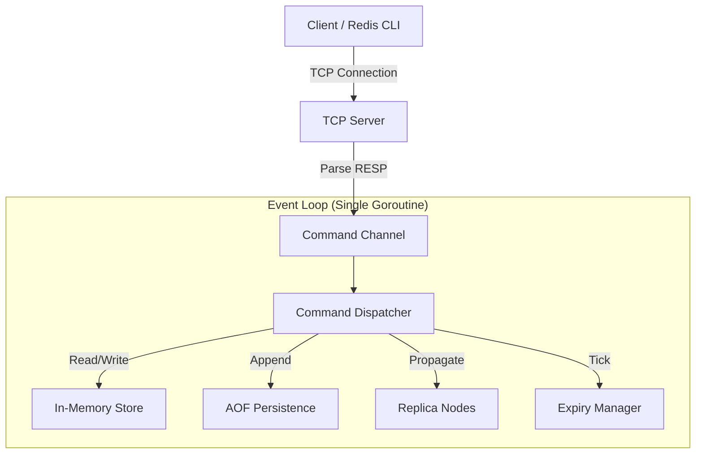

# Mini-Redis Overall Flow & Architecture

This document explains the high-level architecture, data flow, and internal components of `mini-redis`. It is designed to help developers understand how the application works under the hood.

## 1. High-Level Architecture

`mini-redis` follows a **Single-Threaded Event Loop** architecture, similar to the original Redis. This design avoids complex mutex locking for data access by ensuring that all state mutations happen sequentially on a single goroutine.

The system consists of three main layers:

1.  **TCP Transport Layer**: Handles network connections and protocol parsing (RESP).
2.  **Event Loop (The Core)**: The single-threaded engine that executes commands, manages expiry, and handles consensus.
3.  **Storage & Persistence**: In-memory key-value store and Append-Only File (AOF) for durability.

---

## 2. Startup Sequence (`cmd/server/main.go`)

When the server starts:

1.  **CLI Arguments**: It reads flags like `--port` and `--peers`.
2.  **Persistence Loading**: It initializes the AOF (Append-Only File). If an AOF file exists, it **replays** previous commands to restore the in-memory state.
3.  **Event Loop Initialization**: It creates the `EventLoop` struct, which holds the `Store` (map) and configuration.
4.  **TCP Server Start**: It begins listening on the specified port (default `:6379`).
5.  **Background Routine**: The `EventLoop.Start()` method runs in a dedicated goroutine.

---

## 3. Data Flow: The Journey of a Command

Here is how a command like `SET key value` is processed:

### Step 1: Network & Protocol (`internal/server/tcp.go`)
*   The **TCP Server** accepts a new connection from a client.
*   A dedicated goroutine (`handleClient`) reads bytes from the socket.
*   The **RESP Protocol Parser** (`internal/protocol`) decodes the raw bytes into a string array (e.g., `["SET", "key", "value"]`).

### Step 2: The Command Channel
*   The TCP handler **does not execute** the command directly.
*   Instead, it wraps the command and connection into a `Command` struct and pushes it into a buffered channel: `s.Loop.Commands <- cmd`.
*   This channel acts as the synchronization point, converting parallel network traffic into a serial stream of work.

### Step 3: The Event Loop (`internal/server/loop.go`)
*   The main **Event Loop** is an infinite `for-select` loop running on a single goroutine.
*   It pulls the `Command` off the channel.
*   Because it is the only thing accessing the `Store`, no locks are needed.

### Step 4: Execution (`internal/server/execute.go`)
*   The `execute()` method switches on the command name (e.g., "SET").
*   **Write to Store**: It updates the Go map in `internal/store`.
*   **Persistence**: It writes the command to the AOF file on disk.
*   **Replication**: If the node is a Leader, it forwards the command to connected Replicas.
*   **Response**: It writes the result (e.g., `OK`) back to the client's TCP connection.

---

## 4. Key Subsystems

### Persistence (AOF)
*   Every write operation (`SET`, `DEL`) is written to an append-only log file.
*   On restart, this log is read line-by-line to reconstruct the dataset.
*   **BGREWRITEAOF**: Supports background rewriting to compact the log (removes obsolete commands).

### Replication & Consensus
*   **Leader-Follower**: The system supports simple replication. A replica connects to a leader via the `SYNC` command.
*   **Raft-Lite**: The server implements a simplified consensus mechanism for Leader Election:
    *   **Heartbeats**: The leader broadcasts `HEARTBEAT` messages.
    *   **Election**: If a follower doesn't hear from a leader, it becomes a `Candidate` and broadcasts `REQUEST_VOTE`.
    *   **Term/Epoch**: Uses strictly increasing terms to handle split-brain scenarios and stale leaders.

### Expiry
*   Keys with TTLs (Time-To-Live) are managed via a "passive" and "active" strategy:
    *   **Passive**: Checked when a client tries to access the key.
    *   **Active**: The Event Loop occasionally samples keys to delete expired ones, ensuring memory is freed even if keys are never accessed.

---

## 5. Directory Structure

*   `cmd/server/`: Entry point (Main function).
*   `internal/server/`: Core server logic (TCP, Event Loop, Execution).
*   `internal/store/`: The underlying data structure (Map + Expiry).
*   `internal/protocol/`: RESP protocol parser and writer.
*   `internal/persistence/`: AOF file handling.
